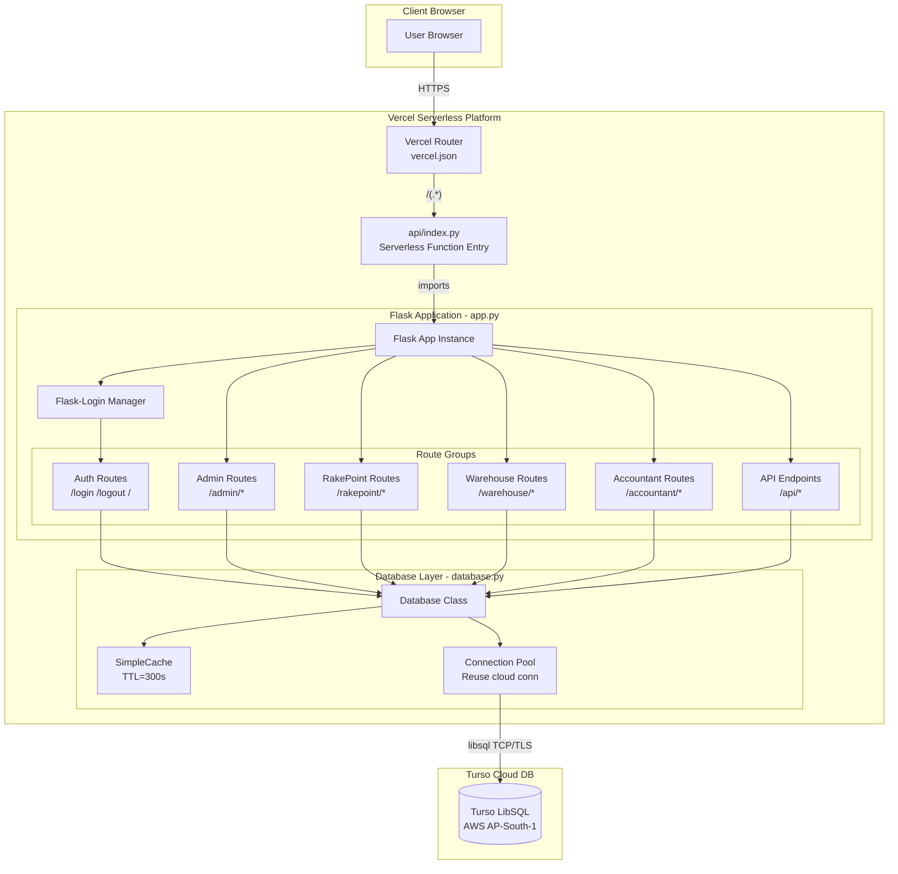
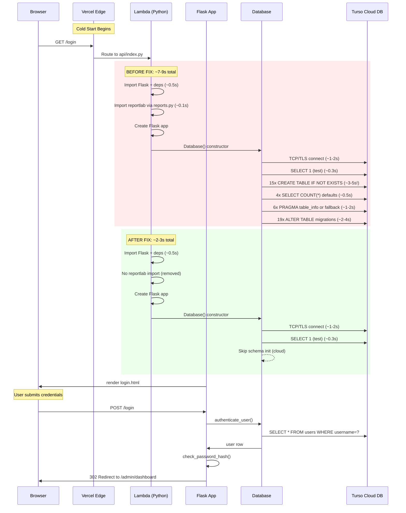
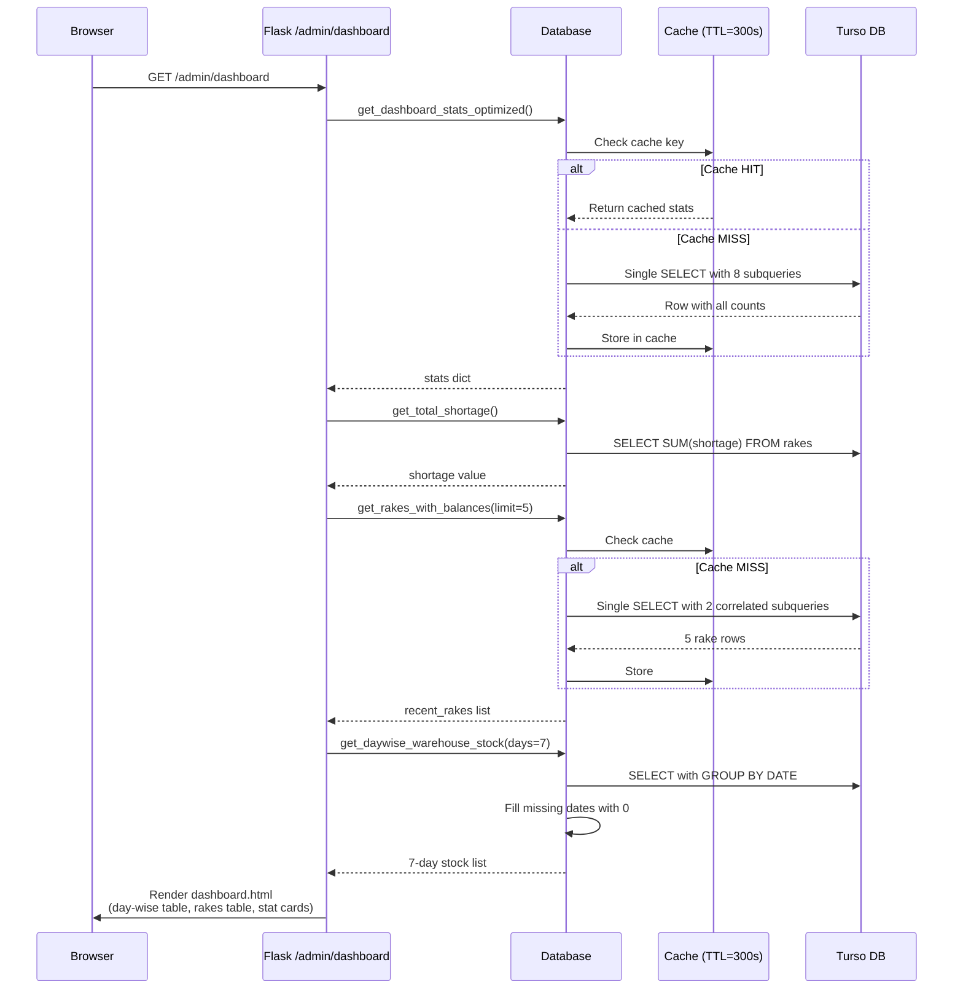
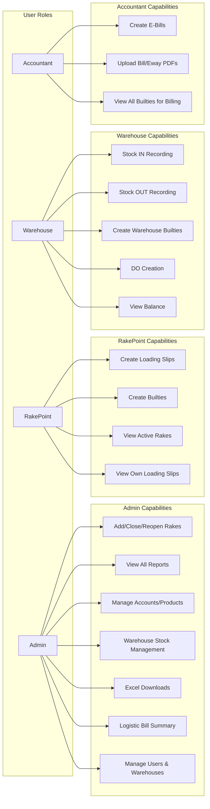
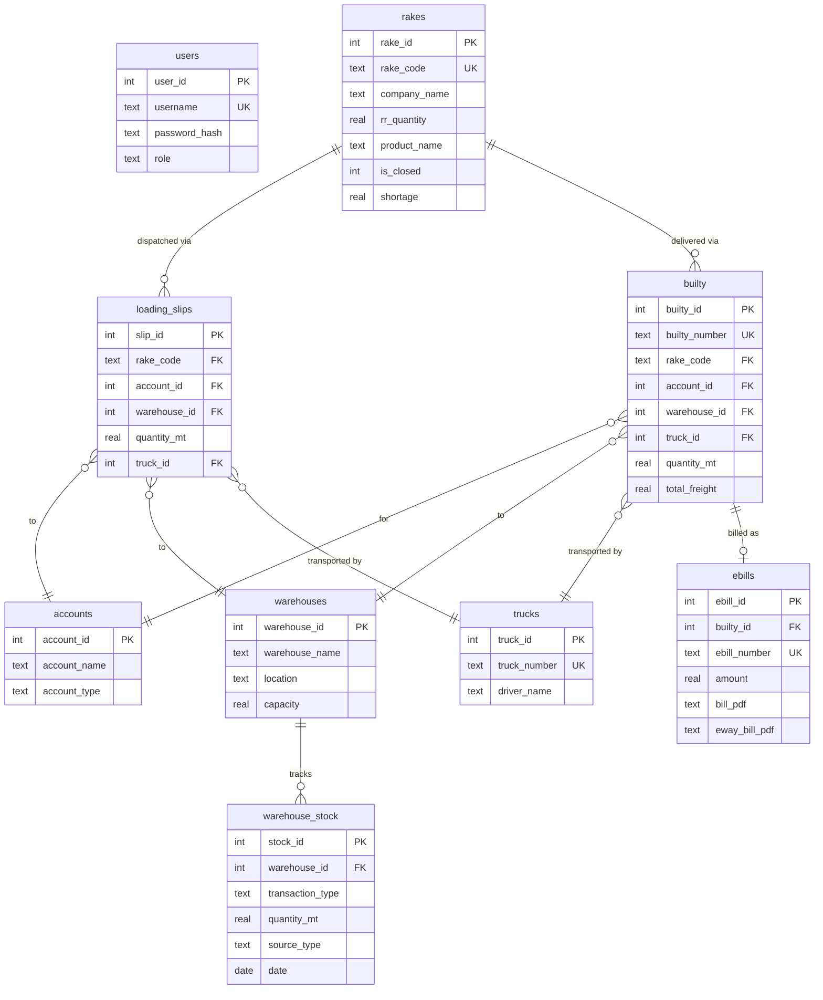
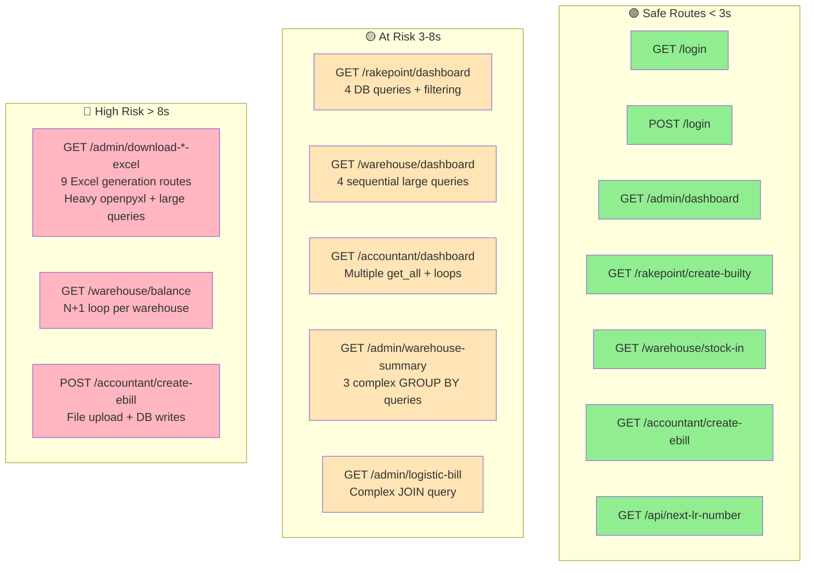

# FIMS System Analysis & Architecture

## System Architecture Diagram

## Cold Start Request Flow (Login Page)

## Admin Dashboard Data Flow

## Role-Based Access Control

## Database Entity Relationship

## Vercel Timeout Risk Map

---

## Vulnerability & Performance Analysis

### Security Findings

| # | Issue | Severity | Location | Status |
|---|-------|----------|----------|--------|
| 1 | **Hardcoded fallback secret key** | MEDIUM | app.py:20 | Set `SECRET_KEY` env var in Vercel |
| 2 | **Default user credentials** | LOW | database.py init | Only created on fresh DB (admin/admin123) |
| 3 | **SQL where_clause via f-string** | LOW* | app.py:1554,1572,1633,4098,4139 | Safe — clause is hardcoded strings with `?` params, but pattern is fragile |
| 4 | **File path traversal** | MITIGATED | Download bill routes | Flask's `send_file` + path construction limits risk |
| 5 | **No rate limiting on login** | MEDIUM | app.py:89 | Brute force possible |
| 6 | **No CSRF protection** | MEDIUM | All POST forms | Flask-WTF not used; session-based but no token validation |

*\*SQL injection classification: The `where_clause` is built from hardcoded column conditions (e.g., `"p.product_id = ?"`) with user values passed as params. Not directly exploitable but the f-string pattern is risky if future developers add unsanitized input.*

### Performance Findings

| # | Issue | Impact | Routes Affected |
|---|-------|--------|-----------------|
| 1 | **Cold start schema init over network** | **CRITICAL** — 5-8s of 10s budget | Every first request after Lambda recycle |
| 2 | **Unused reportlab import at module level** | ~0.1s wasted on every cold start | Every request (via reports.py import) |
| 3 | **N+1 query in warehouse_balance_all()** | O(n) DB calls where n = warehouse count | /warehouse/balance |
| 4 | **N+1 query in rake_summary_excel()** | O(n) DB calls where n = rake count | /admin/download-rake-summary-excel |
| 5 | **9 Excel download routes with heavy I/O** | 5-15s each (openpyxl + large queries) | /admin/download-*-excel |
| 6 | **Unused warehouse stock totals in dashboard query** | 2 extra full-table scans | /admin/dashboard |

### Fixes Applied

| # | Fix | Effect |
|---|-----|--------|
| 1 | **Skip `initialize_database()` for cloud** | **Saves 5-8s** on cold start — schema already exists in Turso |
| 2 | **Remove unused `from reports import ReportGenerator`** | **Saves ~0.1s** — no reportlab loaded at import time |
| 3 | **Remove `time.sleep(0.3)` in connection retry** | **Saves 0.3s** on connection failure path |
| 4 | **Remove total_stock_in/out from dashboard stats query** | **Saves ~0.2s** — 2 fewer full-table scans |
| 5 | **Add empty-state handling in day-wise stock template** | Shows "No data" instead of blank table on error |

### Remaining Recommendations (Not Yet Fixed)

1. **Excel downloads**: Move to client-side generation or async worker (these will always risk timeout)
2. **Warehouse balance N+1**: Refactor to single batch query with GROUP BY warehouse_id
3. **Add CSRF tokens**: Install Flask-WTF for form protection
4. **Add login rate limiting**: Use Flask-Limiter or custom middleware
5. **Set `SECRET_KEY`**: Ensure env var is configured in Vercel (never use fallback in prod)
6. **Connection pool tuning**: Reduce 300s TTL to 60s on Turso connection to handle stale Lambda connections faster

### Test Pipeline Results

- **83/83 tests passing**
- Test categories: Cache (5), Database (16), Auth (9), Authorization (5), Security (7), Performance (6), Route Integration (27), API (1), Timeout Risk (8)
